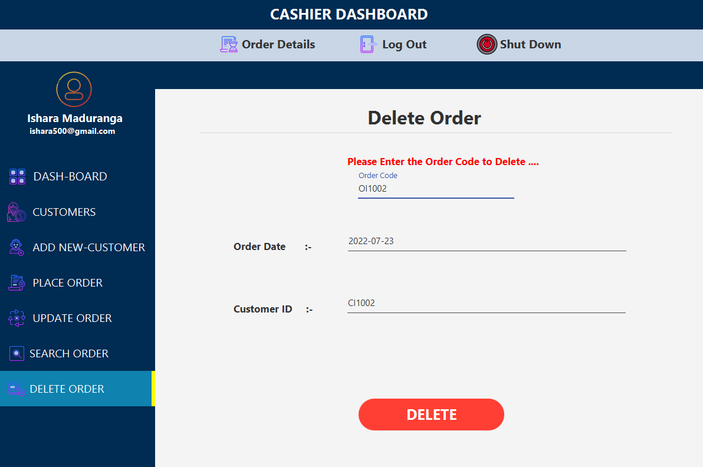

# POS_System-SuperMarket

## Description

#### This Application is Stand Alone Application.Create a Pos System for wholesale Store to manage basic Process. The Project is Implemented Layered architecture.
But first this Project was started by Mvc architecture and later it was converted over to Layered Architecture.

## Main Functions of Application

* Login Interface
* Admin DashBoard Interface
* Cashier DashBoard Interface
* Place Order Interface
* Customes Manage(Crud) Interface
* Items Manage(Crud) Interface
* Order Details Interface
* Search Order Interface
* Update Order Interface
* Delete Order Interface

#### Also,This Application Optimized to Provide for Desktop Devices.

## 💻 Basic Background of Application

### 🛠️ Login Interface

### 🛠️ Admin DashBoard Interface

### 🛠️ Cashier DashBoard Interface

### 🛠️ Place Order Interface

### 🛠️ Customes Manage(Crud) Interface

### 🛠️ Items Manage(Crud) Interface

### 🛠️ Order Details Interface

### 🛠️ Search Order Interface

### 🛠️ Update Order Interface

### 🛠️ Delete Order Interface

## Technology/Framework used
* Java(Layered Architechture
*Javafx
* CSS

## License
**Copyright @ 2022 All Right Reserved By Ishara Maduranga**
